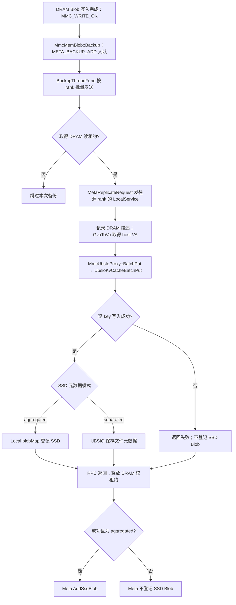
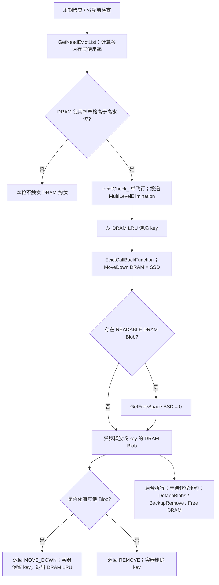
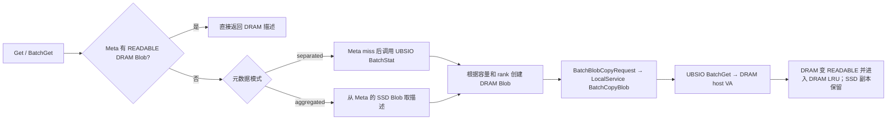

# DRAM 与 L3 UBSIO：当前写入、淘汰和回温路径

分析基线：GitCode `Ascend/memcache` 的 `master`，提交 `bbe48850dd96174101b0d2498eefcaa950368f6c`（2026-09-23）。本文中的 L3 对应代码里的 `MEDIA_SSD` 和 LocalService 使用的 UBSIO。

## 核心结论

当前实现将“写入 L3”和“淘汰 DRAM”分成两条路径：DRAM Blob 变为 `READABLE` 时，通过元数据备份队列异步调用 UBSIO `BatchPut`；DRAM 达到淘汰水位时，淘汰回调释放 DRAM Blob。对正常非零大小的对象，回调**不会在淘汰时调用 UBSIO Put**，因为 `GetFreeSpace(MEDIA_SSD)` 固定返回 0。若 Meta 中已有其他 Blob（通常是成功刷盘后的 SSD Blob），保留 key；否则从淘汰容器删除 key。分离元数据模式下，SSD-only key 由 UBSIO 查询，Meta 中没有 SSD Blob。

因此，开启 UBSIO **不代表所有 key 在首次写入时双写**：HBM Blob 的备份操作只登记元数据；普通 DRAM Blob 的 `WRITE_OK` 才会尝试排队刷盘；从 SSD 回温得到的 DRAM Blob 使用 `META_BACKUP_ADD_REWARM`，不重复刷盘。刷盘是异步且尽力而为的，任务可能被跳过或写入失败，而原始 `WRITE_OK` 仍可成功（`entities/mmc_mem_blob.cpp:64-70,101-111`、`meta_service/mmc_meta_backup_mgr_default.cpp:131-139`、`local_service/mmc_local_service_default.cpp:591-610`）。

代码依据：`common/mmc_types.h:82-113`、`meta_service/mmc_global_allocator.h:277-286`、`meta_service/mmc_meta_manager.cpp:2418-2499`、`local_service/mmc_local_service_default.cpp:577-706`。

## 1. 层级与配置

- 介质编号固定为 `HBM=0 → DRAM=1 → SSD=2 → NONE=3`；`MoveDown(DRAM)=SSD`、`MoveUp(SSD)=DRAM`（`common/mmc_types.h:82-113`）。目前没有 L2.5 介质。
- 默认高、低淘汰水位分别是 90% 和 80%，周期检查默认 5 秒，默认使用 `sharded_lru`（`config/mmc_config_const.h:36-43`）。MetaService 只在周期任务启用且本实例允许执行周期淘汰时调用 `CheckAndEvict(MEDIA_NONE, 0)`（`meta_service/mmc_meta_service.cpp:192-215`）。分配、批量分配以及回温分配前也会检查淘汰（`meta_service/mmc_meta_mgr_proxy.cpp:50-93`、`meta_service/mmc_meta_manager.cpp:2514`）。
- LocalService 的 `ock.mmc.local_service.storage.enabled` 默认关闭。开启后初始化 UBSIO，并在 DRAM 存在时启用 host VA 映射供刷盘使用（`config/mmc_config_const.h:133-137`、`local_service/mmc_local_service_default.cpp:152-165,303-305`）。
- SSD 元数据模式默认为 `aggregated`，可设为 `separated`。前者在 MetaService 保存 SSD Blob，后者以 UBSIO 为 SSD 元数据来源（`config/mmc_config_const.h:34-35`、`common/mmc_storage_mode.h:20-23`）。

## 2. DRAM 数据何时进入 UBSIO

1. `MmcMemBlob::UpdateState(..., MMC_WRITE_OK)` 调用 `Backup()`，普通写入使用 `META_BACKUP_ADD`；回温 Blob 使用 `META_BACKUP_ADD_REWARM`，不会重复触发刷盘（`entities/mmc_mem_blob.cpp:64-70,101-111`、`local_service/mmc_local_service_default.cpp:591-610`）。
2. 备份管理器从队列取任务，先对 DRAM Blob 取得读租约，再发 `MetaReplicateRequest`。取不到租约就跳过该任务；取得租约的请求处理完后释放租约（`meta_service/mmc_meta_backup_mgr_default.cpp:31-45,114-156`、`meta_service/mmc_meta_manager.cpp:1616-1662`）。
3. LocalService 为 DRAM 描述执行 `GvaToVa`，再调用 `MmcUbsIoProxy::BatchPut`；后者调用动态库的 `UbsioKvCacheBatchPut`（`local_service/mmc_local_service_default.cpp:624-706`、`under_api/ubs_io/mmc_ubs_io_proxy.cpp:255-268`、`under_api/ubs_io/dl_ubsio_api.cpp:65-85`）。
4. 成功后，`aggregated` 模式在 LocalService 和 MetaService 登记 SSD 描述；`separated` 模式不在 MetaService 登记 SSD 描述（`local_service/mmc_local_service_default.cpp:654-677`、`meta_service/mmc_meta_backup_mgr_default.cpp:174-204`、`meta_service/mmc_meta_service.cpp:555-568`）。

**精确门槛**：要真正调用 UBSIO `BatchPut`，以下条件需要依次成立：

1. Blob 的状态从 `ALLOCATED` 经 `MMC_WRITE_OK` 成功转换；它不是 SSD 回温产生的 Blob，因此备份操作是 `META_BACKUP_ADD`，并且 Blob 介质为 `MEDIA_DRAM`。HBM 的 `META_BACKUP_ADD` 仅用于元数据备份。
2. 备份管理器正在运行，目标 rank 没有进入 draining 状态；该任务被放进队列。管理器在未运行或 rank draining 时仍返回 `MMC_OK`，但不入队；入队后若 rank 开始 draining，未发送的任务也会被移除（`meta_service/mmc_meta_backup_mgr_default.h:128-142`、`meta_service/mmc_meta_backup_mgr_default.cpp:48-85,220-228`）。
3. 发送阶段的 Meta 网络服务可用；MetaService 仍能按 key 找到描述完全相同且状态为 `READABLE` 的 DRAM Blob，并成功取得读租约；否则不会发出该 key 的刷盘请求。发出的 RPC 也必须到达对应 LocalService（`meta_service/mmc_meta_backup_mgr_default.cpp:48-53,131-161`、`meta_service/mmc_meta_manager.cpp:1616-1641`）。
4. 对应 LocalService 已启用并初始化 UBSIO，BM 代理存在；`blobMap` 没有冲突的同介质描述，且 DRAM GVA 能转换成 host VA。任一条件不满足都不会将该 key 放进 `BatchPut` 参数。非空参数交给已启动的 UBSIO 代理后，才会调用底层 `UbsioKvCacheBatchPut`（`local_service/mmc_local_service_default.cpp:152-165,591-643,688-700`、`under_api/ubs_io/mmc_ubs_io_proxy.cpp:242-268`）。

`BatchPut` 被调用后，还须整体返回 `MMC_OK` 且逐 key 结果为 `0` 才算该 key 刷盘成功。MetaService 将其认作 SSD 副本还要求该 rank 被记录为 SSD 可用；在 `aggregated` 模式下，向 Meta 登记 SSD Blob 又要求 key 当时仍存在（`local_service/mmc_local_service_default.cpp:649-683`、`meta_service/mmc_meta_backup_mgr_default.cpp:174-204`、`meta_service/mmc_meta_manager.cpp:1664-1686`）。

## 3. DRAM 水位淘汰实际做什么

- `GetNeedEvictList` 只检查 HBM、DRAM，跳过 SSD；触发条件为 `used * 100 > total * high`，等于高水位时不触发。申请空间不足但尚未超过高水位时只记录告警，不因此触发淘汰（`meta_service/mmc_global_allocator.h:472-509`）。
- `CheckAndEvict` 只投递淘汰任务；`evictCheck_` 限制同一时刻的常规淘汰轮次。默认分片 LRU 会按全局访问序列选冷 key，目标数量约为 `key数 × (当前百分比 − 低水位) / 高水位`，至少 1 个；这是按 key 数估算，不能保证实际字节使用率降到低水位（`meta_service/mmc_meta_manager.cpp:939-973`、`meta_service/mmc_meta_container_sharded_lru.cpp:186-304`）。
- 回调中，DRAM 下一层虽是 SSD，但 `GetFreeSpace(MEDIA_SSD)=0`，因此正常对象走 `EvictRemoveSrc`。如果仍有其他 Blob，返回 `MOVE_DOWN` 仅表示容器保留，不代表这一步执行了数据搬运；如果没有其他 Blob，返回 `REMOVE`。后台释放由 `PushRemoveList` 执行，有活跃租约时进入独立 `remove_pool`，`FinalizeBlobs` 会等待租约并归还 DRAM 分配器（`meta_service/mmc_meta_manager.cpp:1529-1566,2392-2499`、`entities/mmc_mem_obj_meta.cpp:77-110`）。
- 代码中仍有通用 `MoveBlob → CopyBlob → RPC` 分支，用于可由 allocator 分配目标空间的介质，例如 HBM→DRAM。单条 LocalService `CopyBlob` 只执行 MemFabric `G2G`，并没有 DRAM→SSD 的 UBSIO Put 分支；UBSIO 批量 Put 在异步刷盘和 `BatchCopyBlob` 中（`meta_service/mmc_meta_manager.cpp:2233-2371`、`local_service/mmc_local_service_default.cpp:708-726,766-811,904-918`）。
- `EvictKeys(DRAM, SSD)` 复用相同回调，返回 `MMC_OK` 不代表已写入 SSD；它先摘除 DRAM LRU，再调用回调，且没有处理回调的 `REMOVE/MOVE_DOWN` 返回值（`meta_service/mmc_meta_manager.cpp:2075-2102`）。碎片整理淘汰也复用回调；分配失败后的碎片强制淘汰则同步释放源 Blob（`meta_service/mmc_meta_manager.cpp:1059-1118,1330-1336`）。

## 4. 淘汰后如何读取 L3

`GetByRank` 在分离模式下对 Meta miss 做 UBSIO `BatchStat`，随后分配 DRAM 并按 rank 批量回温；LocalService `BatchCopyBlob` 在 SSD 来源时调用 UBSIO `BatchGet`。回温后的 SSD 副本保留，以便下次释放 DRAM（`meta_service/mmc_meta_manager.cpp:304-356,541-593,596-783`、`local_service/mmc_local_service_default.cpp:766-811,847-929`）。单 key 的 `Get` 在分离模式 Meta miss 时也转到 `GetByRank`（`meta_service/mmc_meta_mgr_proxy.cpp:240-279`）。

## 5. aggregated 与 separated 的元数据语义

两种模式的 DRAM→UBSIO `BatchPut` 数据路径相同；差异在刷盘成功后谁负责保存、查询和维护 SSD key 的元数据。`ock.mmc.meta_service.storage.metadata_mode` 默认 `aggregated`，LocalService 启动时从 MetaService 获取模式（`config/mmc_config_const.h:34-35`、`local_service/mmc_local_service_default.cpp:328-348`）。

| 路径 | `aggregated` | `separated` |
| --- | --- | --- |
| 刷盘后 | LocalService 在 `blobMap_` 增加 SSD 描述；MetaService 回调 `AddSsdBlob`，在原 key 下增加 `MEDIA_SSD` Blob | UBSIO 成为 SSD 元数据来源；LocalService 不增加 SSD 描述，MetaService 也不增加 SSD Blob |
| 仅剩 SSD 时读取 | Meta 中仍有 SSD Blob，直接取得其大小和 rank，再从 UBSIO `BatchGet` 回温到 DRAM | Meta miss 后向可用存储 rank 发 `BatchStorageStatRequest`，从 UBSIO 取得存在性和大小，再分配 DRAM 并调用 `BatchGet` 回温 |
| `Exist` | 查询 Meta 容器 | Meta miss 时调用 UBSIO `BatchStat`；`BatchExist` 对 miss 批量做同样查询 |
| `GetAllKeys` | 从 Meta 容器列出 key，包含已登记的 SSD-only key | 仍只列 Meta 容器中的 key，因此不会列出仅存在于 UBSIO 的 SSD-only key |
| SSD 生命周期 | UBSIO 删除事件会清理 LocalService 的 SSD 描述，并通知 MetaService 移除 SSD Blob | SSD 文件及其生命周期由 UBSIO 管理，不注册上述 Meta 删除事件回调 |
| rank 重注册 | LocalService 对本地备份的 key 执行 UBSIO `BatchExist`，校正并上报 SSD 描述 | LocalService 不上报 SSD 描述；MetaService 重建时过滤 SSD Blob |

依据：`local_service/mmc_local_service_default.cpp:375-400,403-514,646-677,958-990`、`meta_service/mmc_meta_backup_mgr_default.cpp:174-204`、`meta_service/mmc_meta_service.cpp:555-568`、`meta_service/mmc_meta_mgr_proxy.cpp:240-287,375-429,493-501`、`meta_service/mmc_meta_manager.cpp:541-593,1746-1762,1924-1963,2217-2222`。

当前 `Remove` / `BatchRemove` 只调用 Meta 容器的 `Remove(key)`；在 `separated` 模式中，若 key 已成为 SSD-only 且不在 Meta，调用会返回 `MMC_UNMATCHED_KEY`，这条路径不会对 UBSIO 执行删除。若 key 仍有 DRAM Blob，删除 Meta 对象也没有 SSD Blob 可触发 SSD 删除 RPC。增加 L2.5 时应单独定义分离元数据模式下的显式删除语义（`meta_service/mmc_meta_mgr_proxy.h:112-133`、`meta_service/mmc_meta_manager.cpp:1689-1715`、`entities/mmc_mem_obj_meta.cpp:77-105`）。

## 6. 增加 L2.5 前需要确定的边界

1. **放置策略**：L2.5 是完成写入时异步复制，还是 DRAM 淘汰时同步/异步搬运？当前 L3 采用前者，淘汰路径不检查目标副本是否已存在。若需要“下层写成功再释放 DRAM”，应显式建立完成状态和失败处理，不能只改 `MoveDown`。
2. **介质枚举与容量**：`MediaType`、`MoveUp/MoveDown`、`MEDIA_NONE` 作为数组边界的循环、allocator 的 SSD 特判、LRU 的 SSD 排除规则都依赖现有三层编号。L2.5 若有独立容量和水位，需要逐处检查（`common/mmc_types.h`、`meta_service/mmc_global_allocator.h`、`meta_service/mmc_meta_container_lru.cpp`、`meta_service/mmc_meta_container_sharded_lru.cpp`）。
3. **写入与读取接口**：`CopyBlob` 单条路径是 MemFabric G2G；UBSIO 读写在 `BatchCopyBlob` 和异步刷盘路径。L2.5 要明确自己的 LocalService 数据传输接口、批量语义、rank 选择以及从 L2.5 回温时的源/目标介质处理。
4. **元数据归属**：`aggregated` 模式 Meta 持有 SSD Blob；`separated` 模式 SSD-only key 只在 UBSIO 可查。L2.5 的元数据归属会影响 `Get`、`BatchGet`、`Exist`、预取、删除和节点重建（`meta_service/mmc_meta_mgr_proxy.cpp`、`meta_service/mmc_meta_manager.cpp`、`local_service/mmc_local_service_default.cpp`）。
5. **并发与失败窗口**：异步刷盘任务只有取得 DRAM 读租约后才会阻止该 Blob 被立即释放；排队中任务可能因取不到租约而跳过。当前 DRAM 淘汰回调没有等待/验证 UBSIO 写入成功。在 `aggregated` 模式下，刷盘后 `AddSsdBlob` 仍要求 Meta key 存在；如果 key 已从容器删除，登记会返回 `MMC_UNMATCHED_KEY`，而完成回调目前没有检查该返回值（`meta_service/mmc_meta_manager.cpp:1664-1686`、`meta_service/mmc_meta_service.cpp:555-568`）。常规淘汰计数和 `EvictKeys` 返回值也不等同于实际数据搬运完成。

说明：这是源码静态分析；未在本机运行依赖 Ascend/UBSIO 的端到端测试。`test_meta_manager.cpp:1000-1032` 中“SSD 有空闲时淘汰再 CopyBlob”的注释与当前 `GetFreeSpace(MEDIA_SSD)=0` 的实现不一致，判断当前行为时应以源码分支为准。
