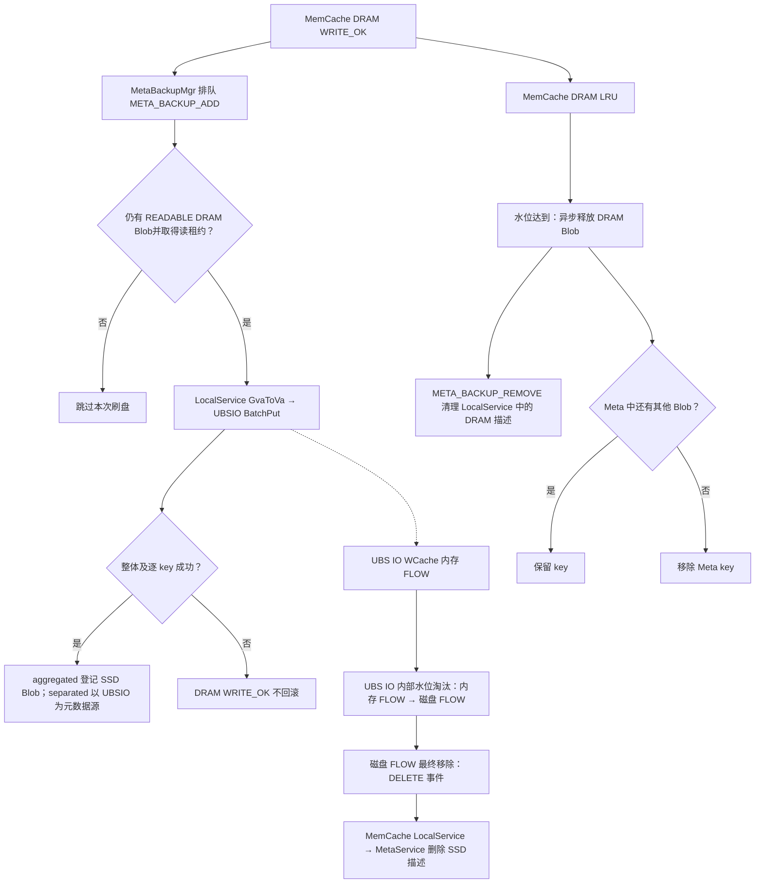
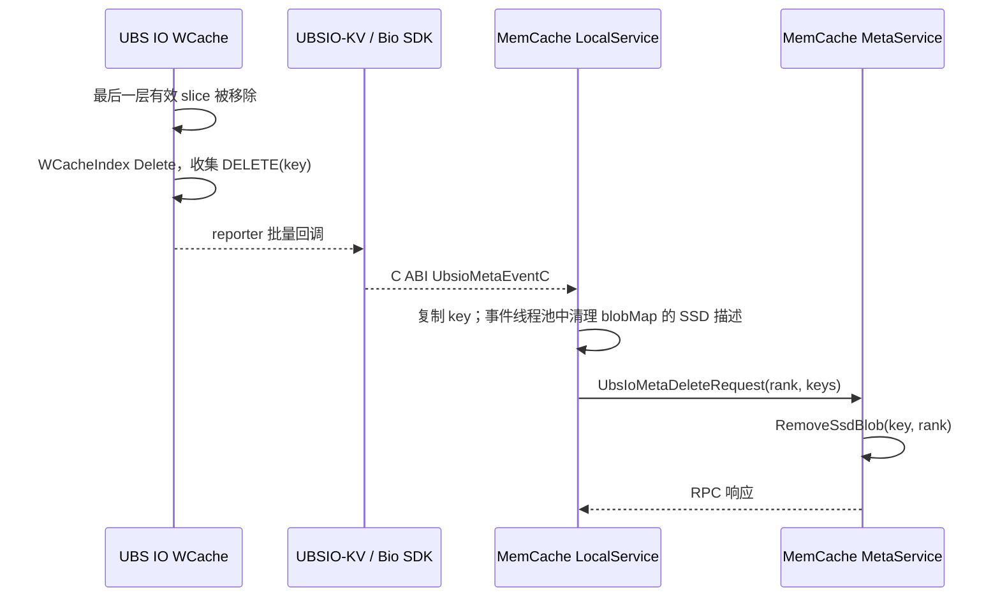

# MemCache 与 UBS IO L3：数据、元数据及接口代码分析

分析基线（2026-09-24）：

- MemCache GitCode master：`04f67ced`，本地 `C:/code/memcache`。
- UBS IO GitCode master：`cdc8e42`，本地 `C:/code/ubs-io`。
- UBS IO 的 KV 适配层不在 master；为追踪 MemCache 实际调用的 C ABI，另读 `release/1.2`：`4285840`，本地 `C:/code/ubs-io-release-1.2`。顶层 README 和 AGENTS.md 均明确该组件所在分支。

本文是源码静态分析。Windows 本机未运行 Linux/NPU/UBSIO 端到端测试，也未验证用户环境安装的 `libubsio_kvc.so.1`。

## 1. 对三条描述的结论

| 描述 | 判断 | 准确语义 |
| --- | --- | --- |
| DRAM 写完提交异步写 SSD，形成双写 | **有条件成立** | 普通 DRAM Blob 完成 `ALLOCATED→READABLE` 后排队尝试 `BatchPut`；HBM-only、SSD 回温、队列被丢弃或写入失败都不形成两个成功副本。对公开 KV 实现，`BatchPut` 先写 UBS IO 的 WCache 内存层，不能直接等同物理 SSD 落盘。 |
| UBS IO FIFO 淘汰并反向通知 | **限定版本与事件** | master 的 WCache slice 淘汰队列入尾出头，但 master 没有 UBSIO-KV 和 MemCache 回调链。`release/1.2` 才有反向 DELETE 事件：只有 UBS IO 最后一层移除仍有效的 key 时通知；内部内存→磁盘迁移不通知。失败重试插入队首，且水位、强制淘汰、角色/offset 等条件参与选择，不能概括为全局严格 FIFO key 淘汰。 |
| MemCache LRU 直接删除 DRAM，不与 UBS IO 交互 | **正常非零大小对象，在 UBS IO 数据接口层面成立** | DRAM 下一层标记为 SSD，但 allocator 对 SSD 的 `GetFreeSpace` 恒返回 0，常规回调走 `EvictRemoveSrc` 并异步释放 DRAM，不在这个回调里做 UBS IO Put/Exist。释放时仍向 LocalService 发送 `META_BACKUP_REMOVE`，清理该 DRAM Blob 的备份描述；若无剩余 Blob，Meta key 可一起消失。此前或并行的异步刷盘是另一条路径。 |

依据：`src/memcache/csrc/entities/mmc_mem_blob.cpp:64-70,101-111`、`src/memcache/csrc/meta_service/mmc_meta_backup_mgr_default.cpp:114-204`、`src/memcache/csrc/meta_service/mmc_global_allocator.h:277-286`、`src/memcache/csrc/meta_service/mmc_meta_manager.cpp:2392-2498`；UBS IO `ubsio-boostio/src/cache/write/wcache_tier.cpp:110-151`（release；master 同名文件有同样入尾出头逻辑）、`ubsio-boostio/src/cache/write/wcache.cpp:685-760,788-884`（release）。

## 2. 实际数据路径与两套淘汰

- MemCache 的异步刷盘只为 `META_BACKUP_ADD + MEDIA_DRAM` 获取读租约并发 RPC。LocalService 还要求 UBSIO/BM 可用、无冲突描述和 `GvaToVa` 成功；`BatchPut` 的整体返回值与逐 key 结果都必须成功。`ADD_REWARM` 只登记回温 DRAM 元数据，不重复写 UBSIO（`src/memcache/csrc/meta_service/mmc_meta_backup_mgr_default.cpp:131-204`、`src/memcache/csrc/local_service/mmc_local_service_default.cpp:577-706`）。
- UBSIO-KV `BatchPut` 调用 `KvOperation::BatchKvPutData`，逐 key 执行 `KvPutData→BioPut`。KV 初始化创建 `WRITE_BACK` 缓存；WCache `PutImpl` 先写内存 tier，`StartEvictSlice` 将 slice 放入内存淘汰队列并安排后台搬迁。物理磁盘是否已有副本取决于后续 UBS IO 内部流程（`ubsio-kv/src/csrc/kvc/ubsio_kvc.cpp:117-167`、`ubsio-kv/src/csrc/kvc/kv_operation.cpp:53-61,170-209`、`ubsio-kv/src/csrc/kvc/dl_biosdk_api.cpp:111-139`、`ubsio-boostio/src/cache/write/wcache.cpp:136-185`；均为 release/1.2）。
- UBS IO 的候选单元是 `WCacheSliceRef`。`AddEvictQueue` 入尾、`GetEvictSlice` 取队首、`RetryEvictQueue` 插队首。内存层超过水位且磁盘层有容量时搬迁；磁盘层超过水位或强制淘汰时尝试最终移除，副本角色/全局 offset 也可能阻止本轮淘汰（`ubsio-boostio/src/cache/write/wcache_tier.cpp:110-151`、`ubsio-boostio/src/cache/write/wcache.cpp:958-1129`；release/1.2）。
- `hasDiskCache=true` 时，内存→磁盘只更新 UBS IO 的 slice 引用和磁盘淘汰队列；`hasDiskCache=false` 时，内存即最后一层，移除会产生 DELETE。磁盘最终移除有效 slice 时也产生 DELETE。若启用 UnderFS，磁盘淘汰前还会尝试写 UnderFS，因此这里的 DELETE 准确含义是从 WCache 索引移除，而非必然销毁所有后端副本；配置默认 UnderFS 类型为 `none`（`ubsio-boostio/src/cache/write/wcache.cpp:689-760,788-863`、`ubsio-boostio/src/config/bio_config_instance.h:94`；release/1.2）。
- MemCache 的 DRAM LRU 在 `EvictRemoveSrc→PushRemoveList→DoRemoveBlobs→FinalizeBlobs` 中释放源 Blob；`FinalizeBlobs` 会调用 `BackupRemove`，最终让 LocalService 对 `blobMap_` 执行 `META_BACKUP_REMOVE`。这是内存 Blob 描述的清理，并没有在此触发 `UbsioKvCachePut`、`BatchPut` 或 `Exist`（`src/memcache/csrc/meta_service/mmc_meta_manager.cpp:1529-1566,2417-2497`、`src/memcache/csrc/entities/mmc_mem_obj_meta.cpp:77-105`、`src/memcache/csrc/entities/mmc_mem_blob.cpp:114-123`、`src/memcache/csrc/local_service/mmc_local_service_default.cpp:610-612`）。

## 3. MemCache 的元数据分层

1. **MetaService 主索引**：`MmcMetaContainer` 按 key 保存 `MmcMemObjMeta`；默认 `sharded_lru`，各介质有自己的 LRU。对象记录权限、优先级、大小和若干 `MmcMemBlob`。Blob 描述包含 `size/gva/rank/mediaType/state/leaseTimeoutTtl/allocSize`，状态含 `ALLOCATED/READABLE/REMOVING`；读写租约在 Blob 上管理（`src/memcache/csrc/meta_service/mmc_meta_container_lru.cpp:32-53`、`src/memcache/csrc/entities/mmc_mem_obj_meta.h:31-49`、`src/memcache/csrc/entities/mmc_blob_common.h:26-40`、`src/memcache/csrc/entities/mmc_blob_state.h:29-83`）。
2. **LocalService 备份索引**：`blobMap_` 保存收到的 HBM/DRAM 描述，`aggregated` 下还保存成功刷盘的 SSD 描述，用于 rank 重注册和 Meta 重建。`META_BACKUP_REMOVE` 移除对应描述；同介质不同描述视为冲突（`src/memcache/csrc/local_service/mmc_local_service_default.cpp:375-490,540-621,654-677`）。
3. **UBS IO 自身索引**：KV 层把 key 映射到 BoostIO；BoostIO `WCacheIndex` 按 partition/key 定位 `WCacheSliceRef`，数据处在自己的内存或磁盘 FLOW。MemCache 的 `MEDIA_SSD` 表示“UBS IO 扩展缓存中的逻辑副本”，不反映其内部物理层（`ubsio-kv/src/csrc/kvc/kv_operation.cpp:53-61`、`ubsio-boostio/src/cache/write/wcache_index.cpp:31-80`；release/1.2）。
4. **完成写入**：`Alloc` 先在 Meta 创建对象与 Blob 并授予写租约；`WRITE_OK` 变可读并触发备份队列。普通 DRAM 的异步 `BatchPut` 成功后，`aggregated` 先在 Local 加 SSD 描述，再由完成回调在 Meta 的原对象上 `AddSsdBlob`。该回调需要 key 当时仍存在（`src/memcache/csrc/meta_service/mmc_meta_manager.cpp:1344-1476,1664-1686`、`src/memcache/csrc/local_service/mmc_local_service_default.cpp:646-677`、`src/memcache/csrc/meta_service/mmc_meta_service.cpp:555-568`）。
5. **读与回温**：有可读 DRAM/HBM 时从内存取；仅 SSD 时回温到 DRAM，SSD 来源保留，回温 DRAM 标记 `IsRewarmOrigin`，`WRITE_OK` 产生 `ADD_REWARM`，避免重刷。`separated` 下 Meta miss 通过 UBS IO `BatchStat` 确认存在和长度，再分配 DRAM/`BatchGet`（`src/memcache/csrc/meta_service/mmc_meta_manager.cpp:304-410,541-593,668-783,1924-1963`、`src/memcache/csrc/meta_service/mmc_meta_mgr_proxy.cpp:240-279`）。
6. **MemCache DRAM LRU**：使用量超过高水位后选择冷 key；`EvictCallBackFunction` 对 DRAM→SSD 因 `GetFreeSpace(SSD)=0` 直接安排释放 DRAM，并向 LocalService 清理该 DRAM Blob 的备份描述。若尚有 SSD/HBM 等 Blob，则 Meta key 保留；否则从容器移除。刷盘排队尚未取得读租约时可与淘汰竞争，当前淘汰回调没有等待 L3 写成功的屏障（`src/memcache/csrc/meta_service/mmc_global_allocator.h:277-286,472-509`、`src/memcache/csrc/meta_service/mmc_meta_manager.cpp:1529-1566,2392-2498`）。
7. **模式、删除和重建**：`aggregated` 的 Meta 和 Local 都登记 SSD，UBS IO DELETE 事件清理它们；重注册时 Local 对备份 key 执行 `BatchExist` 校验 SSD。显式 `Remove` 若命中 Meta 中的 SSD Blob，会沿 `SsdPreFree→BlobDeleteRpc→LocalService::BlobDelete` 异步调用 UBS IO `Delete`。`separated` 不登记 SSD Blob、不注册 DELETE 回调；Meta miss 时问 UBS IO，重注册只重建内存层。此模式下，SSD-only 且不在 Meta 的 key 执行 `Remove/BatchRemove` 会返回未找到，也不会由此调用 UBS IO Delete。`GetAllKeys` 同样只枚举 Meta 容器（`src/memcache/csrc/local_service/mmc_local_service_default.cpp:375-514,729-750`、`src/memcache/csrc/meta_service/mmc_meta_manager.cpp:1689-1715,1746-1762,2217-2222`、`src/memcache/csrc/meta_service/mmc_meta_manager.h:188-190`、`src/memcache/csrc/meta_service/mmc_meta_mgr_proxy.h:112-133`）。

## 4. UBS IO 反向删除 Meta SSD 描述

完整调用链（UBS IO 部分均来自 release/1.2）：`WCache::EvictFromDiskToUnderFsImpl` 或无磁盘时的 `EvictFromMemToDiscard` → `WCacheManager` 的 evict callback（删除 `WCacheIndex` 并 `AppendMetaEvent(DELETE)`）→ pending vector/reporter → `Cache::RegUbsIoMetaEventCallback` → `bio_server` 转 C 事件 → `BioRegisterMetaEventCallback` → `UbsioKvCacheRegisterMetaEventCallback` → MemCache `MmcUbsIoProxy::StaticMetaEventCallback` → `MmcLocalServiceDefault::HandleUbsIoMetaEvents` → Meta RPC → `MmcMetaManager::RemoveSsdBlob`（UBS IO `ubsio-boostio/src/cache/write/wcache.cpp:710-760,788-863`、`ubsio-boostio/src/cache/write/wcache_manager.cpp:218-235,693-743,1357-1397`、`ubsio-boostio/src/server/bio_server.cpp:72-96,1247-1255`、`ubsio-boostio/src/sdk/bio.cpp:714-720`、`ubsio-kv/src/csrc/kvc/ubsio_kvc.cpp:89-96`；MemCache `src/memcache/csrc/under_api/ubs_io/mmc_ubs_io_proxy.cpp:91-163`、`src/memcache/csrc/local_service/mmc_local_service_default.cpp:494-514,934-990`、`src/memcache/csrc/meta_service/mmc_meta_net_server.cpp:432-445`、`src/memcache/csrc/meta_service/mmc_meta_mgr_proxy.cpp:493-501`、`src/memcache/csrc/meta_service/mmc_meta_manager.cpp:1587-1613`）。

需区分以下语义：

- UBS IO **不直接调用 MetaService**。它把事件通过同进程 C callback 交给 LocalService，再由 LocalService 走网络 RPC。MemCache 仅在 `aggregated` 注册该回调；`separated` 由 UBS IO 管理自身元数据。
- release/1.2 UBS IO 也生成 `RECOVER` 事件，但当前 MemCache 静态回调只收集 `DELETE`，没有对应的 RECOVER RPC。`aggregated` 的现有重建依赖 LocalService 备份 key 的 `BatchExist`，不能把 UBS IO RECOVER 事件算作已接通。
- 上报是尽力而为：UBS IO 无已注册回调时丢弃事件；MemCache 本地先清 SSD 备份，再发 RPC，失败只记日志；Meta 对每个 key 的 `RemoveSsdBlob` 结果计数后仍对整批返回 `MMC_OK`。因此不能把事件回调当作与实际淘汰原子一致的确认协议（`ubsio-boostio/src/cache/write/wcache_manager.cpp:1376-1397`、`src/memcache/csrc/local_service/mmc_local_service_default.cpp:958-990`、`src/memcache/csrc/meta_service/mmc_meta_mgr_proxy.cpp:493-501`）。

## 5. MemCache ↔ UBSIO-KV C ABI 全量清单

MemCache 在 `DlUbsioApi::LoadLibrary` 中 `dlopen("libubsio_kvc.so.1")`，无条件加载下表 16 个符号，另可选加载 1 个资源指标符号。`已调用` 表示当前生产源码存在调用链；`仅封装` 表示有代理方法或客户端遗留代码，但没有可达的生产调用点。装载与符号清单见 `src/memcache/csrc/under_api/ubs_io/dl_ubsio_api.cpp:23-93`，代理见 `src/memcache/csrc/under_api/ubs_io/mmc_ubs_io_proxy.cpp:91-449`。

| UBSIO-KV C 符号 | 当前 MemCache 用途 | 状态 |
| --- | --- | --- |
| `UbsioKvCacheInit` | LocalService 启用存储时初始化；通过 `UBSIO_CONFIG_PATH` 传配置文件 | 已调用 |
| `UbsioKvCacheExit` | LocalService 关闭时清理 | 已调用 |
| `UbsioKvCacheRegisterMetaEventCallback` | aggregated 模式初始化时注册元数据事件；MemCache 只消费 DELETE | 已调用 |
| `UbsioKvCacheBatchPut` | DRAM 异步刷盘；`BatchCopyBlob` 的 DRAM→SSD 分支 | 已调用 |
| `UbsioKvCacheBatchGet` | SSD→DRAM 回温时 `BatchCopyBlob` | 已调用 |
| `UbsioKvCacheDelete` | aggregated 模式显式释放 SSD Blob 时的 `BlobDeleteRpc` | 已调用 |
| `UbsioKvCacheBatchExist` | aggregated 模式 LocalService 重注册时校验已有 SSD key | 已调用 |
| `UbsioKvCacheBatchStat` | separated 模式 Meta miss 时批量查询存在性和长度 | 已调用；公开 release/1.2 缺符号 |
| `UbsioKvCacheBatchGetDirect` | 代理与客户端遗留 `ProcessUbsIoBatchGetWithHBM`；该方法无调用点，release/1.2 实现也明确不支持 | 仅封装 |
| `UbsioKvCachePut` | 单条代理方法 | 仅封装 |
| `UbsioKvCacheGet` | 单条代理方法 | 仅封装 |
| `UbsioKvCacheExist` | 单条代理方法 | 仅封装 |
| `UbsioKvCacheGetLength` | 单条代理方法 | 仅封装 |
| `UbsioKvCacheBatchDelete` | 批量代理方法 | 仅封装 |
| `UbsioKvCacheBatchGetLength` | 批量代理方法 | 仅封装 |
| `UbsioKvCacheBatchFree` | 批量代理方法 | 仅封装 |
| `UbsioGetResourceInfo` | 客户端指标采集 `UbsIoCollector` | 可选加载，已调用 |

调用点：`src/memcache/csrc/local_service/mmc_local_service_default.cpp:445-447,494-514,646-652,729-750,823-831,904-918`、`src/memcache/csrc/client/metric/mmc_ubs_io_collector.cpp:21-30`、`src/memcache/csrc/client/mmc_client_default.cpp:909-958`。release/1.2 的 C ABI 头为 `ubsio-kv/include/ubsio_kvc.h`；`BatchGetDirect` 不支持见 `ubsio-kv/src/csrc/kvc/ubsio_kvc.cpp:345-357`。

### 源码版本的 ABI 缺口

UBS IO **master 没有** `ubsio-kv/` 和上述 `UbsioKvCache*` 导出实现；`release/1.2` 虽有 KV 和回调，但不定义 MemCache master **强制加载**的 `UbsioKvCacheBatchStat`。`DL_LOAD_SYM` 遇缺失符号就返回 `MMC_ERROR`，故不能用公开 release/1.2 源码生成的库直接证明当前 MemCache 的 UBS IO 初始化可成功，`aggregated` 也会受强制装载影响。用户环境若有更新的二进制库，需要核对其实际导出符号和版本（`src/memcache/csrc/common/mmc_functions.h:27-35`、`src/memcache/csrc/under_api/ubs_io/dl_ubsio_api.cpp:73-90`；公开 release/1.2 `ubsio-kv/include/ubsio_kvc.h`、`ubsio-kv/src/csrc/kvc/ubsio_kvc.cpp`）。

## 6. 对 L2.5 设计的直接约束

- 先定义 MemCache 的 L2.5 与 UBS IO 内部 WCache 内存 FLOW 是否为同一资源；目前后者对 MemCache 完全隐藏，`MEDIA_SSD` 只表示 UBS IO 逻辑副本。
- 若要求“L3 真正落 SSD 后才淘汰 DRAM”，当前 `BatchPut` 返回值和 Meta SSD Blob 均不足以作物理落盘凭据；需要新的完成状态或查询/确认协议。
- 若增加新的独立介质或下层缓存，需分别定义数据搬运完成、Meta/Local/后端三份索引的归属、最终淘汰事件、删除和恢复重建；当前异步队列、DELETE 通知和显式 Remove 都没有端到端事务保证。
